# Modular Combat Component Pack

**Documentation & Integration Guide**
Version 1.0 • Unreal Engine 5.3 – 5.8 • DeadSteel Studio

A modular, interface-driven combat toolkit for Unreal Engine 5. Drop four independent Actor Components onto any character to add dodge, melee attack, stamina, and health systems — each usable on its own or together, with built-in UI, sensible defaults, and full Blueprint access.

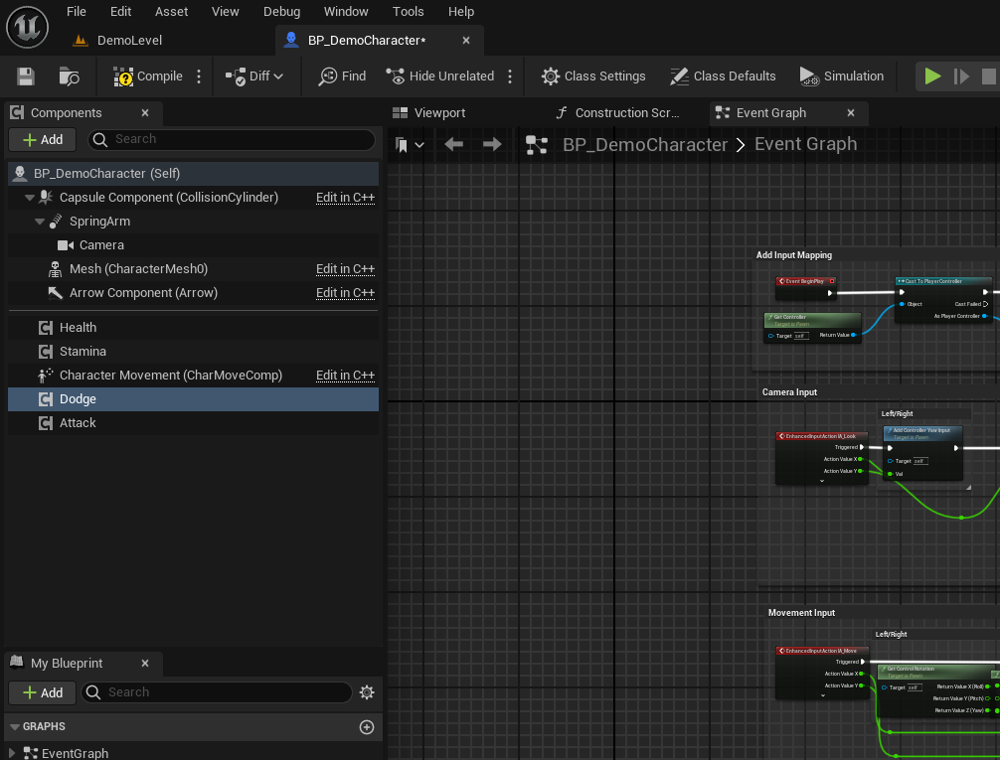

## Table of Contents

1. [Overview](#1-overview)
2. [System Requirements](#2-system-requirements)
3. [Installation](#3-installation)
4. [Quick Start](#4-quick-start)
5. [Component Reference](#5-component-reference)
6. [HUD & Widget System](#6-hud--widget-system)
7. [The IDamageable Interface](#7-the-idamageable-interface)
8. [Animation Notify Setup (Required)](#8-animation-notify-setup-required)
9. [Enhanced Input Setup](#9-enhanced-input-setup)
10. [Extending the System](#10-extending-the-system)
11. [Known Limitations](#11-known-limitations)
12. [Credits & Third-Party Assets](#12-credits--third-party-assets)
13. [Support](#13-support)

---

## 1. Overview

Modular Combat Component Pack provides four self-contained Actor Components — **Stamina**, **Health**, **Dodge**, and **Attack** — built around a shared `IDamageable` interface. Each component works independently, so you only need to add the ones your project actually uses. When combined, they cooperate automatically: Dodge and Attack consume stamina if a Stamina Component is present, and Attack applies damage to any Actor that implements the Damageable interface, regardless of whether that Actor uses this plugin's Health Component or a custom one.

### 1.1 What's included

| Component | Purpose | Depends on |
|---|---|---|
| **Stamina Component** | Tracks a stamina pool with automatic regeneration; exposes Consume/Add functions used by Dodge and Attack. | None (standalone) |
| **Health Component** | Tracks health, exposes Set/Add/ApplyDamage, broadcasts OnDeath. Implements the damage side of combat. | None (standalone) |
| **Dodge Component** | Root-motion dodge/roll with directional (4-way) or single-animation modes and i-frame invulnerability. | Stamina Component (optional) |
| **Attack Component** | Melee attack with randomized animation variations and a sphere-sweep hit trace between two sockets. | Stamina Component (optional) |

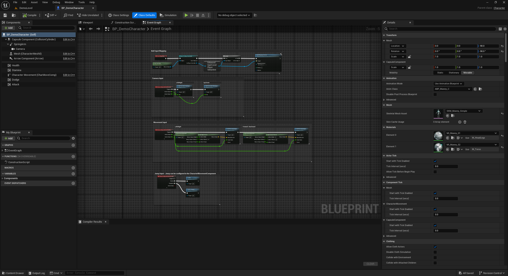

### 1.2 Design principles

- **Modular** — every component can be added, removed, or used in isolation.
- **Zero setup by default** — each component ships with default animations, input actions, and UI already assigned, so dragging a component onto a character produces working behavior immediately.
- **Hybrid C++ / Blueprint** — core logic is written in C++ for performance, but every property and event is exposed to Blueprint (`EditAnywhere` / `BlueprintCallable` / `BlueprintAssignable`), so no C++ knowledge is required to use or customize the pack.
- **Interface-driven combat** — damage flows through the `IDamageable` interface, not a hard reference to the Health Component, so the pack integrates with custom health/damage systems as easily as with its own.

---

## 2. System Requirements

- Unreal Engine 5.3 through 5.8.
- Enhanced Input plugin (enabled automatically as a plugin dependency).
- A Skeletal Mesh character using root-motion animations for Dodge and Attack (a Third Person–style character is recommended).

> **Note:** This package was developed and tested in UE 5.3, with compile verification performed on UE 5.8. If you encounter an issue on a specific engine version, please reach out (see [Support](#13-support)).

---

## 3. Installation

### 3.1 Recommended: install through Fab

This package is distributed as a Code Plugin (Engine Plugin download type). When installed through an official Fab downloader, it is installed once to your chosen engine version and is then available to any project using that engine — no manual file copying is required.

1. Install the plugin via the Epic Games Launcher (Fab tab) or the in-editor Fab browser (Content Browser > Fab), and choose the engine version you want it installed to.
2. Open your project.
3. Go to **Edit > Plugins**, search for "Modular Combat Component Pack", and make sure it is enabled.
4. Restart the editor if prompted.
5. The plugin's content (components, widgets, demo character, and default animations) is now available under Plugins content in the Content Browser (enable **Show Plugin Content** from the Content Browser settings if it is not visible).

### 3.2 Manual installation (.zip download)

If you downloaded a `.zip` directly from the Fab website instead of using one of the installers above:

1. Extract the `.zip` into your engine's Plugins folder (or your project's own `Plugins/` folder, if you prefer a per-project install).
2. Open your project. Unreal Engine will detect the plugin.
3. Continue from step 3 above (Edit > Plugins > enable).

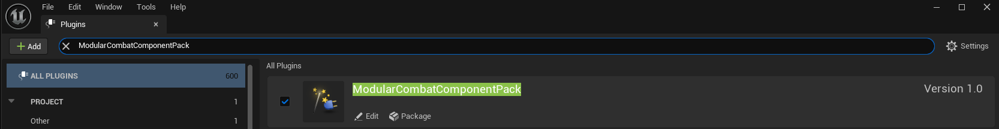

---

## 4. Quick Start

The fastest way to see the pack in action:

1. Open the demo level included in the plugin's `Content/Demo` folder.
2. Press Play. The demo character already has all four components configured.
3. Use the default inputs (configurable via Enhanced Input) to move, dodge, and attack the sample targets in the scene.

To add the system to your own character:

1. Open your Character Blueprint (or C++ character class).
2. Add any combination of Stamina, Health, Dodge, and Attack components from the Components panel.
3. Press Play. Each component works immediately with its built-in defaults — no additional setup is required.

> **Note:** Default animations, input actions, and widgets are only used as a fallback. Any field left assigned to the plugin default can be overridden per-character from the component's Details panel.

---

## 5. Component Reference

### 5.1 Stamina Component

Tracks a stamina pool that regenerates automatically after a delay following the last time it was spent.

**Properties**
- `Max Stamina` (float) — the stamina pool's maximum value. Default: `100`.
- `Regen Rate` (float) — stamina restored per second once regeneration begins. Default: `15`.
- `Regen Delay` (float) — seconds after the last consumption before regeneration starts. Default: `1.5`.
- `Widget Class` / `Main HUD Widget Class` — pre-assigned to the plugin's default stamina widget and shared HUD container; override to use your own UI.

**Functions**
- `ConsumeStamina(Amount) → bool` — subtracts `Amount` if available and returns `true`; returns `false` and changes nothing if insufficient.
- `AddStamina(Amount)` — restores stamina, clamped to `Max Stamina`.
- `GetCurrentStamina()` / `GetStaminaPercent()` — read the current value.

**Events**
- `OnStaminaChanged(NewValue, MaxValue)` — broadcast whenever stamina changes; drives the stamina widget.

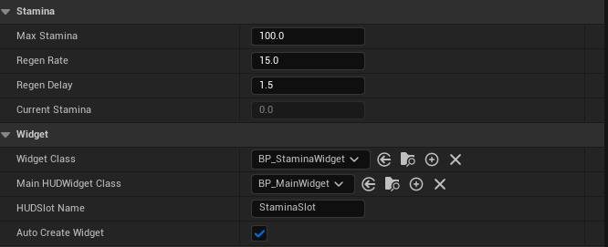

### 5.2 Health Component

Tracks health and exposes the functions used to modify it from anywhere — combat, healing items, scripted events, or a custom inventory system.

**Properties**
- `Max Health` (float). Default: `100`.
- `Widget Class` / `Main HUD Widget Class` — same mechanism as Stamina; assigned by default, overridable.

**Functions**
- `SetHealth(NewValue)` — clamps to `[0, MaxHealth]` and broadcasts the change.
- `AddHealth(Amount)` — convenience wrapper for healing (potions, regeneration, pickups, etc.).
- `ApplyDamage(DamageAmount)` — convenience wrapper for taking damage; called from the character's `ReceiveCombatHit`.
- `GetCurrentHealth()` / `GetHealthPercent()` / `IsDead()`.

**Events**
- `OnHealthChanged(NewValue, MaxValue)` — drives the health widget.
- `OnDeath()` — broadcast once when health reaches zero.

> **Note:** The Health Component intentionally does not implement `IDamageable` itself. The interface belongs on the owning Actor (see [Section 7](#7-the-idamageable-interface)); the component only stores the data and exposes the functions the Actor calls.

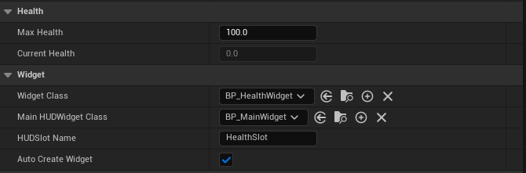

### 5.3 Dodge Component

A root-motion dodge/roll with two modes, selectable per character:

- **Single animation mode** (default) — one Dodge Montage plays regardless of movement direction.
- **Directional mode** (`Use Directional Dodge = true`) — up to four montages (Forward / Backward / Left / Right) are assigned in an array; the component reads the character's last movement input and plays the closest matching montage, falling back to Forward if a direction has no montage assigned.

**Properties**
- `Use Directional Dodge` (bool) — toggles between the two modes above; the editor shows only the relevant fields.
- `Dodge Montage` — used in single-animation mode. Pre-assigned to a default roll animation.
- `Directional Dodge Montages` — used in directional mode.
- `Dodge Stamina Cost` (float). Default: `20`.
- `Dodge Input Action` — pre-assigned to the plugin's default Input Action; override to remap.
- `Can Interrupt Attack` (bool) — if `false` (default), `TryDodge` is blocked while this Actor's Attack Component has an attack in progress, so a dodge input cannot cancel an ongoing attack. Set to `true` to allow dodging out of an attack at any time.

**Runtime state**
- `Is Dodging` (bool, read-only) — true only while the notify-driven invulnerability window is active (see [Section 8](#8-animation-notify-setup-required)).

**Functions**
- `TryDodge()` — checks stamina, plays the resolved montage. Safe to bind directly to input or call from Blueprint.

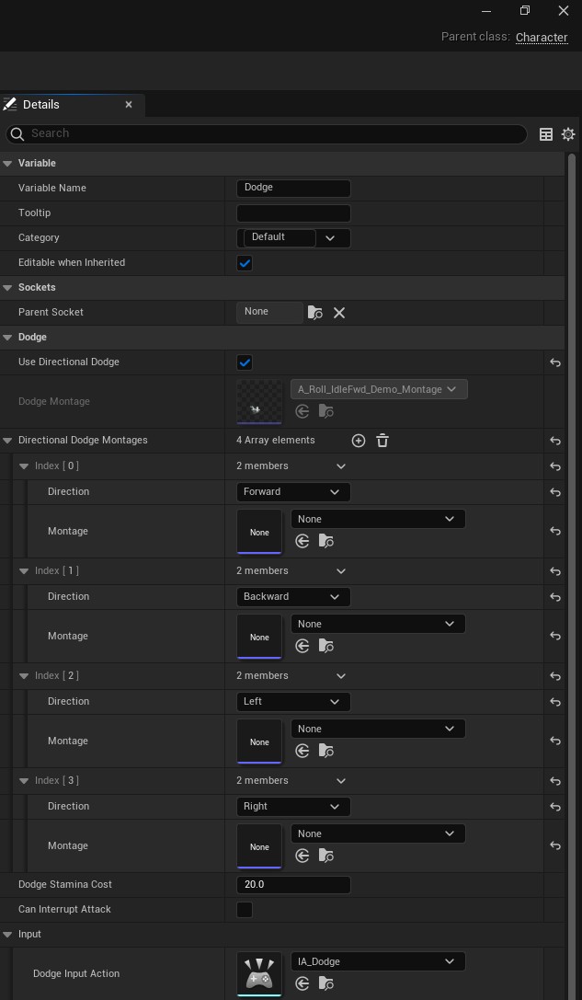

### 5.4 Attack Component

A melee attack with randomized animation variation and a socket-to-socket sweep trace for hit detection.

**Properties**
- `Attack Montages` (array) — one is chosen at random on each attack; pre-populated with one default animation.
- `Attack Stamina Cost` (float). Default: `15`.
- `Trace Radius` (float) — radius of the sweep, in Unreal units. Default: `40`.
- `Damage Amount` (float) — damage passed to `ReceiveCombatHit` on a successful hit. Default: `10`.
- `Trace Start Socket Name` / `Trace End Socket Name` (FName) — two skeletal mesh sockets defining the sweep. Start defaults to `hand_r`. Leaving End empty collapses the sweep to a single point (suitable for unarmed attacks); setting both (e.g. a weapon's hilt and tip sockets) sweeps a capsule along the weapon's blade.
- `Attack Input Action` — pre-assigned to the plugin's default Input Action.
- `Draw Debug Trace` (bool) — visualizes the sweep in PIE for tuning. Leave off in shipped builds.
- `Can Interrupt Dodge` (bool) — if `false` (default), `TryAttack` is blocked while this Actor's Dodge Component is mid-dodge, so an attack input cannot cancel an ongoing dodge. Set to `true` to allow attacking out of a dodge at any time.

**Functions & events**
- `TryAttack()` — locks out repeat input until the montage finishes (via its end delegate), so mashing the input cannot skip or overlap attacks.
- `OnAttackHit(HitActor, HitResult)` — broadcast on every successful hit, after damage has been applied, carrying the full `FHitResult`. Use this to trigger hit VFX, sound, camera shake, or knockback without modifying the component.

> **Note:** Each attack window ignores repeat hits on the same Actor (tracked internally), so a single sweeping attack cannot damage the same target multiple times.

> **Note:** By default, Dodge and Attack block each other while either is in progress (an attack input during a dodge, or a dodge input during an attack, is simply ignored). This is controlled independently on each component via `Can Interrupt Attack` / `Can Interrupt Dodge`, so you can allow either or both to cancel into one another if your combat design calls for it.

#### Setting up a weapon trace (e.g. a sword)

The default `hand_r` socket alone gives a single-point trace, which is fine for unarmed attacks. For a weapon, add two sockets to the weapon's mesh (or the mesh it's attached to) and reference them by name:

1. In the Skeletal Mesh or Static Mesh editor for the weapon, open the Skeleton Tree / socket list and add two sockets — for example `Socket_SwordStart` at the base of the blade (near the hilt) and `Socket_SwordEnd` at the tip.
2. Position each socket so it sits directly on the blade, not floating off to the side — this is what the trace will sweep between.
3. On the Attack Component, set `Trace Start Socket Name` to `Socket_SwordStart` and `Trace End Socket Name` to `Socket_SwordEnd`.
4. Enable `Draw Debug Trace` temporarily and play the attack animation — you should see the debug sweep travel along the blade from hilt to tip.

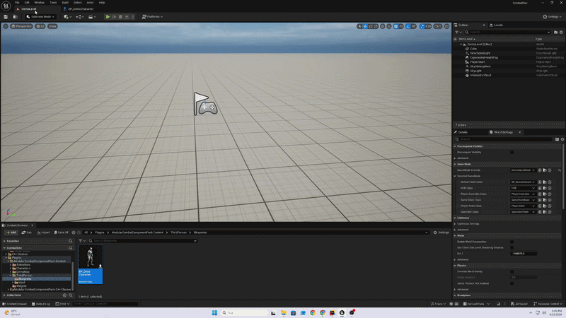

> **Note:** Socket names are typed in as plain text (`FName`) and are not validated against the mesh in the editor — a typo will silently fall back to the character's location rather than throwing an error. If the debug trace doesn't appear where expected, double-check the socket name spelling first.

---

## 6. HUD & Widget System

Stamina and Health each have their own widget, but both are inserted into a single shared HUD container rather than being added to the viewport independently — this lets you lay out both bars exactly where you want them on screen.

**How it works**
- Each component has a `Main HUD Widget Class` property (a `UMainHUDWidget`) and a `Widget Class` property (its own small widget).
- The first component to run finds or creates the shared Main HUD widget and adds it to the viewport; any other component reuses the same instance.
- Each component then places its own widget into a Named Slot inside the Main HUD, identified by name (`StaminaSlot` for Stamina, `HealthSlot` for Health).
- The widget is only created for player-controlled Pawns — attaching Stamina or Health to an AI-controlled Actor does not spawn any UI.

**Customizing the layout**
1. Open (or duplicate) the plugin's `WBP_MainHUD` widget.
2. Arrange two Named Slot widgets anywhere on the canvas, named exactly `StaminaSlot` and `HealthSlot`.
3. Assign your customized Main HUD Blueprint to the `Main HUD Widget Class` field on both the Stamina and Health components.

**Customizing the bars themselves**

Duplicate `WBP_StaminaWidget` or `WBP_HealthWidget`, bind your own visuals to the `OnStaminaUpdated` / `OnHealthUpdated` event (which supplies the current value, max value, and pre-calculated percent), and assign your version to the component's `Widget Class` field.

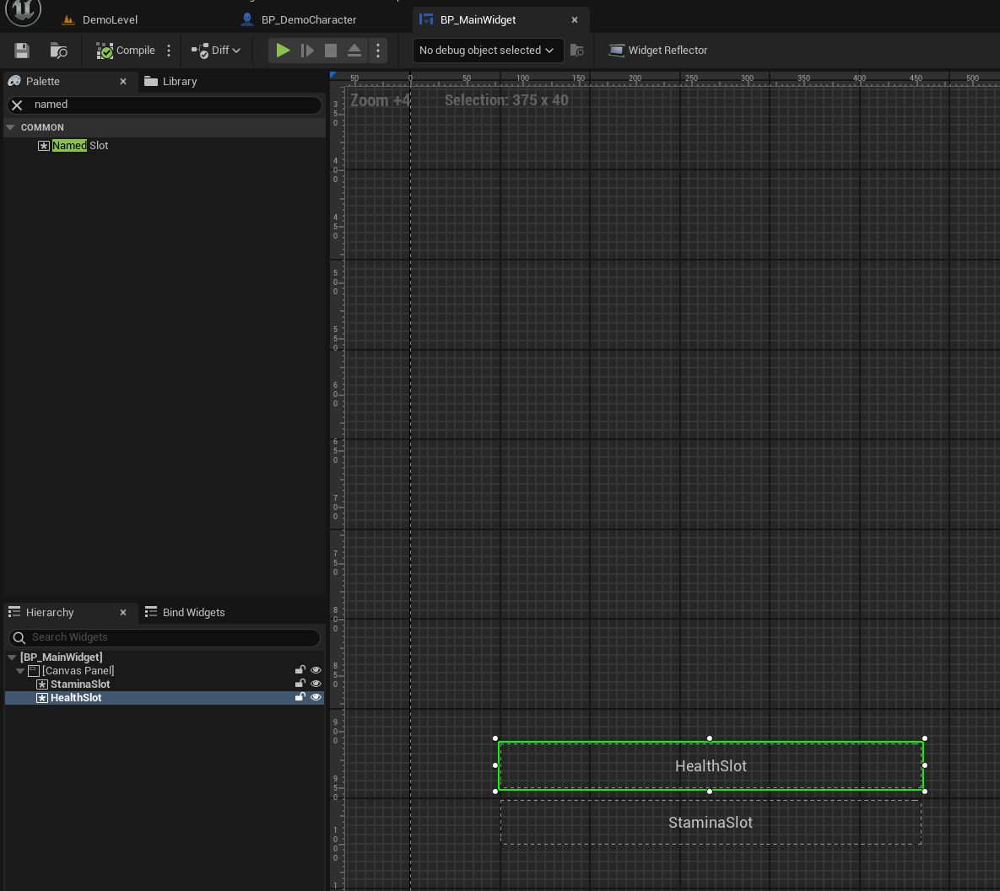

---

## 7. The IDamageable Interface

Combat damage is routed entirely through a native interface, `IDamageable`, rather than a direct reference to the Health Component. This is what lets the Attack Component damage any Actor — including one using a completely custom health system — without any code changes.

**Functions to implement**
- `ReceiveCombatHit(DamageAmount, HitInfo)` — called on a successful hit. Typically forwards to your Health Component's `ApplyDamage`, but can drive any system you want.
- `CanReceiveDamage() → bool` — queried before damage is applied. Return `false` while the Actor should be invulnerable (for example, checking the Dodge Component's `Is Dodging` flag) to implement i-frames.

**Implementing it on a character**
1. Open the character's Class Settings and add `IDamageable` under Implemented Interfaces.
2. In the Interfaces section of My Blueprint, implement `ReceiveCombatHit` — typically a single call to your Health Component's Apply Damage.
3. Implement `CanReceiveDamage` — for a character using the Dodge Component, return `NOT Is Dodging`.

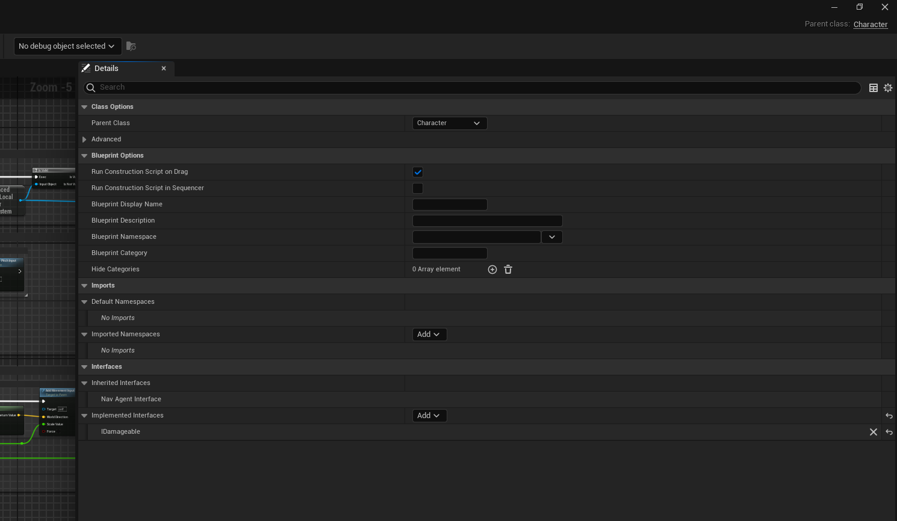

> **Note:** The interface function is named `ReceiveCombatHit` rather than `ReceiveHit` specifically to avoid colliding with `AActor`'s built-in physics collision event of the same name.

---

## 8. Animation Notify Setup (Required)

> **This is the one setup step required when using your own animations instead of the package defaults. Read this section carefully.**

Both Dodge and Attack rely on custom Anim Notify States to know exactly when, during the animation, their effect should be active. If you replace the default montages with your own animations, you must add these notify states yourself.

### 8.1 Dodge I-Frame (`AN_DodgeIFrame`)

A single Notify State that marks the invulnerability window of a dodge.

1. Open your custom dodge Anim Montage in the Animation editor.
2. In the Notifies panel, right-click the timeline and choose **Add Notify State... > Dodge I-Frame**.
3. Drag the notify onto the section of the animation where the character should be invulnerable (for example, the middle portion of a roll, not the recovery frames at the start or end).
4. Resize it by dragging its edges to match the desired duration.

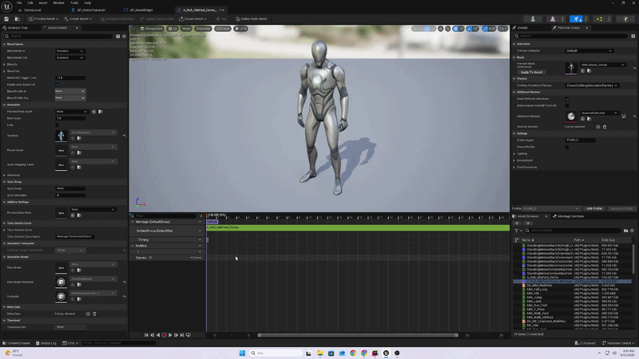

While this notify is active, the Dodge Component's `Is Dodging` flag is `true`, and any character whose `CanReceiveDamage` checks that flag will be immune to the Attack Component's damage.

### 8.2 Attack Trace (`AN_AttackTrace`)

A single Notify State that drives the hit-detection sweep for the duration it covers.

1. Open your custom attack Anim Montage.
2. **Add Notify State... > Attack Trace**, from the same right-click menu.
3. Drag it onto the section of the swing where the weapon (or fist) should actually be able to hit something — not the wind-up or the recovery.

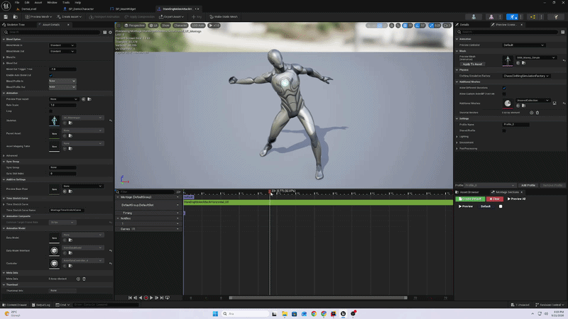

On `NotifyBegin` the attack window opens (and the per-attack hit list is cleared); every tick while the notify is active, a sweep trace runs between the Trace Start Socket and Trace End Socket; on `NotifyEnd` the window closes.

> **Note:** If you forget to add either notify, the corresponding component will simply do nothing on that part of the animation (no invulnerability, or no hit detection) — it will not throw an error. If a dodge or attack appears to have no effect, this is the first thing to check.

---

## 9. Enhanced Input Setup

Both Dodge and Attack ship with a default Input Action already assigned, but that action must be mapped to a physical key inside an Input Mapping Context that is actually applied to the player, or nothing will happen when the key is pressed.

1. Open (or create) your Input Mapping Context.
2. Add the plugin's `IA_Dodge` and/or `IA_Attack` actions and map them to the keys you want.
3. Confirm that this Mapping Context is added via `AddMappingContext` in your character or player controller's setup — this project's existing Third Person–style setup usually already does this for its own actions; you only need to add the new actions to that same context.
4. To use entirely different Input Actions, assign your own to the `Dodge Input Action` / `Attack Input Action` fields on the respective component.

---

## 10. Extending the System

### 10.1 Custom inventory / interaction systems

Interaction, inventory, and item pickup are intentionally not part of this package — they vary too much between games to standardize. Instead, Health and Stamina expose simple public functions (`SetHealth`, `AddHealth`, `ApplyDamage`, `AddStamina`) that any custom system can call directly. A healing potion, for example, only needs to get a reference to the character's Health Component and call Add Health.

### 10.2 Additional combat states (parry, block, etc.)

Because invulnerability is decided through `CanReceiveDamage` on the character, adding a new defensive mechanic (a parry or block component, for example) does not require modifying the Health Component or the Attack Component — only adding your new component's own condition into the character's `CanReceiveDamage` implementation.

---

## 11. Known Limitations

- **No multiplayer / network replication.** All components are designed for single-player or listen-server-authoritative use; values are not replicated.
- **No inventory or interaction system is included** (see [10.1](#101-custom-inventory--interaction-systems)).
- **No enemy AI is included.** The Health Component works on any Actor, but AI behavior, aggro, or hit reactions are left to the project.

---

## 12. Credits & Third-Party Assets

The default dodge/roll animation included with this package is used under the Creative Commons Attribution 4.0 International License (CC BY 4.0).

- Animation: **[Free Sample Animation Set]** by **[VanillaLoop]** — licensed under [CC BY 4.0](https://creativecommons.org/licenses/by/4.0/).

> Replace the bracketed placeholders above with the exact creator name and pack title before publishing.

---

## 13. Support

For questions, bug reports, or feature requests, please reach out through the publisher page on Fab (DeadSteel Studio) or the contact details listed on the product page.
